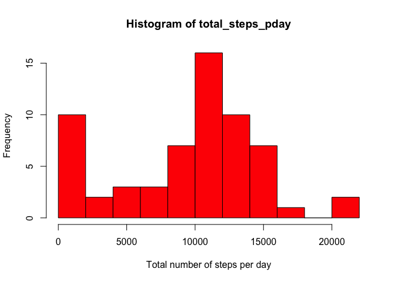
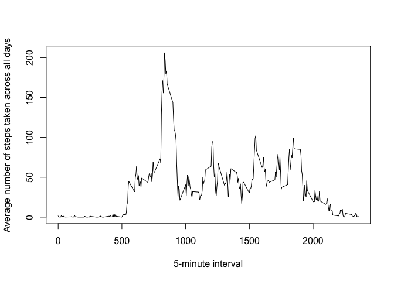
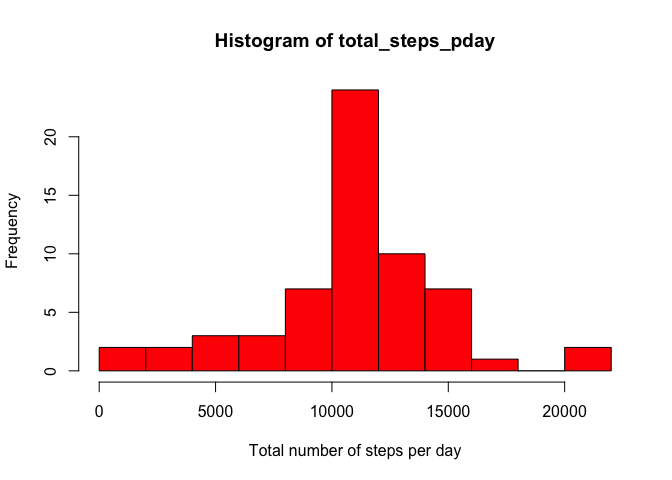

# Reproducible Research: Peer Assessment 1


## Loading and preprocessing the data  
### 1. Unzip the file  

```r
unzip("activity.zip", overwrite=TRUE)
```

### 2. Load the data  

```r
activity <- read.csv("activity.csv")
```

### 3. Read the summary of data  

```r
summary(activity)
```

```
##      steps                date          interval     
##  Min.   :  0.00   2012-10-01:  288   Min.   :   0.0  
##  1st Qu.:  0.00   2012-10-02:  288   1st Qu.: 588.8  
##  Median :  0.00   2012-10-03:  288   Median :1177.5  
##  Mean   : 37.38   2012-10-04:  288   Mean   :1177.5  
##  3rd Qu.: 12.00   2012-10-05:  288   3rd Qu.:1766.2  
##  Max.   :806.00   2012-10-06:  288   Max.   :2355.0  
##  NA's   :2304     (Other)   :15840
```

### 4. Read the first 6 rows  

```r
head(activity)
```

```
##   steps       date interval
## 1    NA 2012-10-01        0
## 2    NA 2012-10-01        5
## 3    NA 2012-10-01       10
## 4    NA 2012-10-01       15
## 5    NA 2012-10-01       20
## 6    NA 2012-10-01       25
```

## What is mean total number of steps taken per day?  
### 1. Calculate the total number of steps taken per day  

```r
library(plyr)
activity_total_steps <- ddply(activity, .(date), summarize, total_steps_pday = sum(steps, na.rm=TRUE))
head(activity_total_steps)
```

```
##         date total_steps_pday
## 1 2012-10-01                0
## 2 2012-10-02              126
## 3 2012-10-03            11352
## 4 2012-10-04            12116
## 5 2012-10-05            13294
## 6 2012-10-06            15420
```

### 2. Make a histogram of the total number of steps taken each day  

```r
with(activity_total_steps, hist(total_steps_pday, xlab="Total number of steps per day", breaks=8, col="red"))
```

 

### 3. Calculate and report the mean and median of the total number of steps taken per day  
#### 3.1 Mean of the total number of steps taken per day  

```r
with(activity_total_steps, round(mean(total_steps_pday), digits = 0))
```

```
## [1] 9354
```

#### 3.2 Median of the total number of steps taken per day  

```r
with(activity_total_steps, median(total_steps_pday))
```

```
## [1] 10395
```

## What is the average daily activity pattern?  
### 1. Make a time series plot of the 5-minute interval (x-axis) and the average number of steps taken, averaged across all days (y-axis)  

```r
daily_activity_pattern <- ddply(activity, .(interval), summarize, total_steps_pday = mean(steps, na.rm=TRUE))
with(daily_activity_pattern, plot(interval, total_steps_pday, type="l",  
                                  xlab="5-minute interval", 
                                  ylab="Average number of steps taken across all days"))
```

 

### 2. 5-minute interval, on average across all the days in the dataset, contains the maximum number of steps  

```r
max_ind <- which.max(daily_activity_pattern$total_steps_pday)
daily_activity_pattern[max_ind, "interval"]
```

```
## [1] 835
```

## Imputing missing values  
### 1. Calculate and report the total number of missing values in the dataset  

```r
nrow(subset(activity, is.na(steps)))
```

```
## [1] 2304
```

### 2. Filling in all of the missing values in the dataset using **the mean for that 5-minute interval**, create a new dataset that is equal to the original dataset but with the missing data filled in  

```r
activity_imputed <- join(activity, daily_activity_pattern, by="interval")
activity_imputed[is.na(activity_imputed$steps), "steps"] <- activity_imputed[is.na(activity_imputed$steps), "total_steps_pday"]
activity_imputed$total_steps_pday <- NULL
head(activity_imputed)
```

```
##       steps       date interval
## 1 1.7169811 2012-10-01        0
## 2 0.3396226 2012-10-01        5
## 3 0.1320755 2012-10-01       10
## 4 0.1509434 2012-10-01       15
## 5 0.0754717 2012-10-01       20
## 6 2.0943396 2012-10-01       25
```

### 3. Make a histogram of the total number of steps taken each day  

```r
activity_total_steps <- ddply(activity_imputed, .(date), summarize, total_steps_pday = sum(steps, na.rm=TRUE))
with(activity_total_steps, hist(total_steps_pday, xlab="Total number of steps per day", breaks=8, col="red"))
```

 

### 4. Calculate and report the **mean** and **median** total number of steps taken per day  
#### 4.1 **Mean**  total number of steps taken per day  

```r
with(activity_total_steps, round(mean(total_steps_pday), digits = 0))
```

```
## [1] 10766
```

#### 4.2 **Median** total number of steps taken per day  

```r
with(activity_total_steps, round(median(total_steps_pday), digits = 0))
```

```
## [1] 10766
```

## Are there differences in activity patterns between weekdays and weekends?  
#### 1. Create a new factor variable in the dataset with two levels - "weekday" and "weekend" indicating whether a given date is a weekday or weekend day  

```r
activity_imputed$date <- as.Date(activity_imputed$date, format = "%Y-%m-%d")
activity_imputed$weekday <- as.factor(ifelse(weekdays(activity_imputed$date) %in% c("Saturday", "Sunday"), "weekend", "weekday"))
head(activity_imputed)
```

```
##       steps       date interval weekday
## 1 1.7169811 2012-10-01        0 weekday
## 2 0.3396226 2012-10-01        5 weekday
## 3 0.1320755 2012-10-01       10 weekday
## 4 0.1509434 2012-10-01       15 weekday
## 5 0.0754717 2012-10-01       20 weekday
## 6 2.0943396 2012-10-01       25 weekday
```

### 2. Make a panel plot containing a time series plotof the 5-minute interval (x-axis) and the average number of steps taken, averaged across all weekday days or weekend days (y-axis)  

```r
# Calculate the average number of steps taken across all weekday days or weekend days
activity_imputed_activity_pattern <- ddply(activity_imputed, .(interval, weekday), summarize, total_steps_pday = mean(steps, na.rm=TRUE))
# load lattice library
library(lattice)
xyplot(total_steps_pday ~ interval | weekday, data= activity_imputed_activity_pattern, layout = c(1, 2), ylab = "Number of steps", 
       panel = function(x, y, ...) {
         panel.xyplot(x, y, type="l", ...)
         })
```

 
